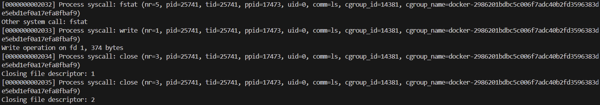

```
sudo apt-get install libcurl4-openssl-dev libjson-c-dev zlib1g-dev libpq-dev libpqxx-dev
```

```
cd libpqxx
git checkout 7.5.1
mkdir build && cd build \
    && cmake .. \
    && make -j$(nproc) \
    && sudo make install \
    && cd ../.. \
    && ldconfig
export PKG_CONFIG_PATH=/usr/local/lib/pkgconfig:$PKG_CONFIG_PATH
```

```
RUN apt-get update && apt-get install -y \
    g++ \
    make \
    clang \
    llvm \
    gcc \
    libelf1 \
    libelf-dev \
    zlib1g-dev \
    libcurl4-openssl-dev \
    libjson-c-dev \
    libpq-dev \
    libyaml-dev \
    build-essential \
    cmake \
    wget \
    pkg-config \
    git \
    && rm -rf /var/lib/apt/lists/*

# libpqxx 7.5.1 설치
RUN wget https://github.com/jtv/libpqxx/archive/refs/tags/7.5.1.tar.gz -O libpqxx-7.5.1.tar.gz \
    && tar -xzf libpqxx-7.5.1.tar.gz \
    && cd libpqxx-7.5.1 \
    && mkdir build && cd build \
    && cmake .. \
    && make -j$(nproc) \
    && make install \
    && cd ../.. \
    && rm -rf libpqxx-7.5.1 libpqxx-7.5.1.tar.gz \
    && ldconfig

# PKG_CONFIG_PATH 설정 (libpqxx 설치 경로 추가)
ENV PKG_CONFIG_PATH=/usr/local/lib/pkgconfig:$PKG_CONFIG_PATH
```
